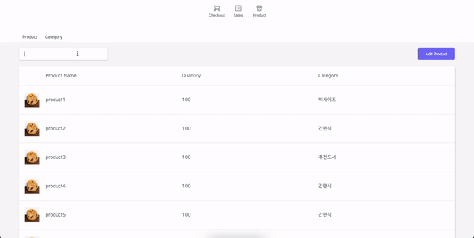

# CHERGROUND Web POS

## Introduction

관리자가 상품 정보 및 카테고리를 추가하고, 상품을 장바구니에 담아 결제할 수 있는 Web POS 사이트 구현 프로젝트

- 기간: 2021. 11. 01. ~ 2021. 11. 26.
- [Backend GitHub](https://github.com/cheesepuff90/CHERground_project)
- Zeplin에 명시 되어있는 기획과 디자인을 보고 구현하였습니다.
- CRA 없이 프로젝트 초기 세팅부터 레이아웃 및 기능을 직접 구현하였으며, 모든 데이터는 프론트와 백의 통신으로 받아온 데이터입니다.

## Members

- **Frontend**: 정민지, 성해호
- **Backend**: 김도훈, 송영록

## Technology

- **Frontend**: `React`, `Hook`, `Styled-Components`
- **Backend**: `Node.js`, `Express`, `AWS`, `MySQL`, `Docker`
- **Common**: `Typescript`, `MVVM Design Pattern`, `Git`

## MVVM 디자인 패턴

- Clean Architecture를 프로젝트에 적용하기 위해 MVVM 디자인 패턴을 사용하였습니다.
- entity - data(API) - repository - usecase - view model - view 로 계층을 분리하여, 데이터 통신이 이루어지는 코드와 뷰를 작동시키는 코드를 분리하였습니다.
- Entity에 User, Product, Category 등 객체의 속성들을 interface로 만들어 정의해두고, Entity를 import 하여 Promise 객체의 반환 타입이나 함수 인자 타입을 지정해주었습니다.
- 계층마다 `index.ts` 파일에 class에서 사용할 함수와 타입들을 지정해둔 interface를 정의하고 각 class에 implement하여 사용함으로써,
  class를 일일히 보지 않고 `index.ts` 파일만 확인하면 어떤 함수들이 정의되어 있는지 알 수 있도록 하였습니다.

## Main Function

- **로그인**: 관리자가 아이디와 비밀번호를 입력하여 로그인
- **장바구니**: 전체 상품 리스트 확인 및 유저가 장바구니에 추가한 상품 리스트 확인
- **상품 옵션 선택**: 장바구니에 담을 상품의 옵션과 개수를 선택
- **상품 옵션 수정**: 장바구니에 담긴 상품의 옵션 수정 및 할인율 적용
- **새 상품 추가**: 관리자가 POS에 새 상품을 추가하기 위해, 상품명/가격/옵션/이미지/카테고리 등을 입력하고 저장
- **상품 정보 수정**: 관리자가 POS에 등록된 상품의 정보들을 수정하고 저장
- **새 카테고리 추가**: 관리자가 POS에 등록된 상품의 카테고리를 새로 생성하기 위해, 카테고리명과 해당 카테고리에 포함시킬 상품들을 등록
- **카테고리 정보 수정**: 관리자가 POS에 등록된 카테고리 정보를 수정 및 삭제

## Part

- 정민지: 로그인, 장바구니, 상품 옵션 선택 및 수정, 새 카테고리 추가, 카테고리 정보 수정
- 성해호: 새 상품 추가, 상품 정보 수정

## 담당 부분 상세 설명

**1. 리스트 페이지**

- 상품 이름, 수량, 카테고리 포함된 리스트 보여주는 메인 페이지 구현.

**2. 새 상품 추가**

- Add page에서 상품 정보를 입력후, save 버튼 클릭 시, 리스트 페이지에 추가되도록 구현.
